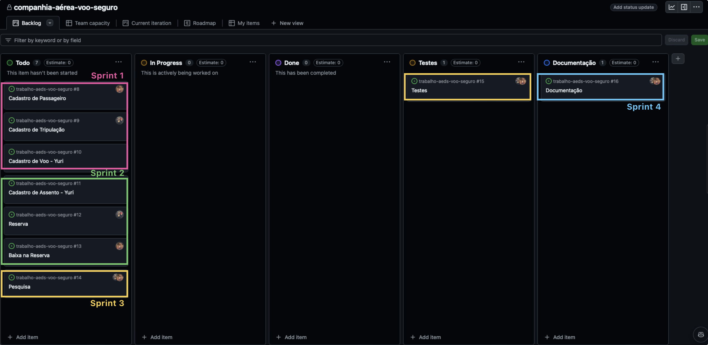
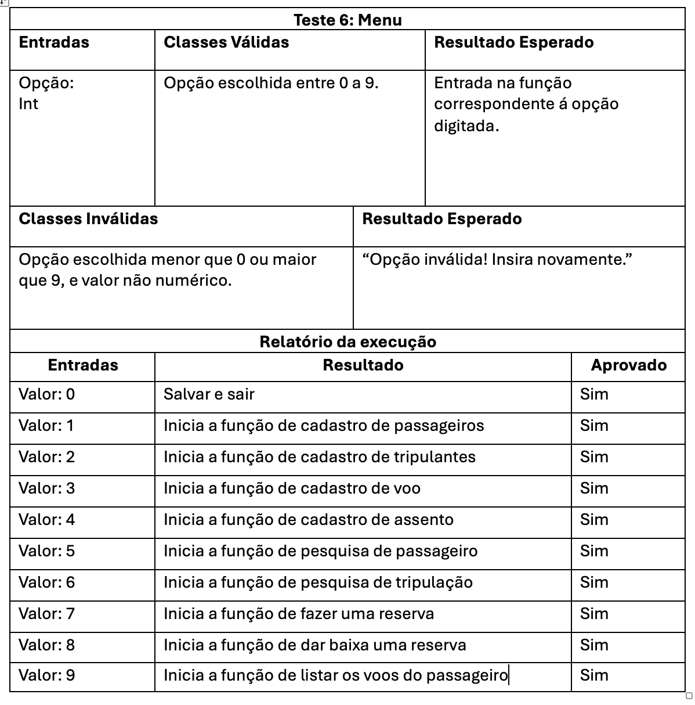

# Trabalho AEDS-1 - Companhia Aérea Voo Seguro

## Projeto
A Voo Seguro é uma companhia aérea operante em todo o Brasil, cujo maior objetivo é garantir a satisfação de seus passageiros e promover sua fidelização, contando com uma equipe
de tripulação composta por pilotos, copilotos e comissários. Este projeto é um sistema desenvolvido em linguagem C a fim de auxiliar a companhia Voo Seguro no gerenciamento, possibilitando o cadastro de passageiros, tripulação e voos da companhia e controle de reservas de assentos e Sistema de Fidelidade da empresa. 

## Bibliotecas Utilizadas
- _stdio.h_: Biblioteca padrão da linguagem c, fornece funções que executam a entrada e saída de dados no sistema, como o scanf e printf, e manipulação de dados em arquivo.
- _stdlib.h_: Fornece funções empregadas para o controle de fluxo e término do software, manipulação de números e strings e gerenciamento de memória. 
- _string.h_: Biblioteca utilizada para a manipulação de strings (conjuntos de caracteres).
- _assert.h_: Biblioteca que permite a verificação de condições durante a execução de um programa. Usada para a manipulação dos casos de teste implementados para o sistema, auxiliando na validação dos testes. 

## Estruturas de Dados
- **typedef struct Passageiros**: Utilizada para armazenamento dos dados dos passageiros da companhia Voo Seguro: código, nome, endereço, telefone, e se participa do Programa Fidelidade da Companhia, indicando o número de pontos.
- **typedef struct Tripulação**: Utilizada para o armazenamento dos dados dos tripulantes da companhia: código do tripulante, nome, telefone e cargo (piloto, copiloto ou comissário).
- **typedef struct Voo**: Armazena as informações dos voos da companhia: código do voo, data e hora, origem, destino, código do avião, tarifa do voo e código do piloto, copiloto e comissários do voo.
- **typedef struct Assento**: Armazena os dados dos assentos dos voos: código do voo em que o assento está, número do assento e status (livre ou ocupado).
- **typedef struct Reserva**: Armazena as informações referentes à uma reserva: número do assento reservado, código do voo em que o assento se encontra e código do passageiro que realizou a reserva.

## Funções Utilizadas: 
- **void CadastrarPassageiro(Passageiro passageiros[], int * qtdPassageiros,)**: Empregada para inclusão de um novo passageiro dentro de um sistema de gerenciamento. Recebe como parâmatros um vetor 'passageiros' do tipo Passageiro e um ponteiro int que indica a quantidade de passageiros cadastrados no sistema (*qtdPassageiros). Cria uma estrutura 'novoPassageiro' do tipo Passageiro, e atribui um código identificador único a ele. Em seguida, solicita ao usuário que digite o nome, endereço e telefone do passageiro que deseja cadastrar, e  armazena os dados recebidos dentro do 'novoPassageiro' recém criado. Por fim, solicita que o usuário indique se o passageiro cadastrado faz parte do Programa Fidelidade da companhia (teclando 1 caso participe, e 2 caso não participe), e armazena esta informação em 'novoPassageiro'. Após a coleta e armazenamento dos dados, armazena 'novoPassageiro' dentro do vetor passageiros na posição indicada por qtdPassageiros, e incrementa o valor desse contador. Por fim, fornece uma mensagem ao usuário indicando que o cadastro do passageiro foi concluido com sucesso e o código do passageiro cadastrado.
  
  
- **void cadastrarTripulacao (Tripulacao tripulantes [], int * qtdTripulantes)**: Empregada para incluir um novo membro ao sistema de gerenciamento da tripulação da companhia aérea. Recebe como parâmetros um vetor tripulantes do tipo Tripulação e um ponteiro int que sinaliza o valor de tripulantes cadastrados (**qtdTripulantes**). Cria uma estrutura 'novoTripulante' do tipo Tripulante, e atribui um código identificador único a ela. Solicita que o usuário insira o nome, telefone e selecione o cargo do tripulante que deseja cadastrar(piloto, copiloto ou comissário), de acordo com as opções númericas fornecidas (1, 2 e 3). Verifica se o valor digitado corresponde a um destes três valores numéricos: em caso negativo, gera uma mensagem ao usuário informando que o cargo digitado por ele é inválido, e a operação de cadastro não é finalizada, retornando ao menu inicial. Em caso positivo, o 'novoTripulante' é adicionado ao vetor tripulantes, o contador qtdTripulantes é incrementado e exibe-se uma mensagem ao usuário sinalizando que o cadastro foi concluido e o código do tripulante recém cadastrado.

- **void cadastrarVoo (Voo voos[], int * qtdVoos, Tripulacao tripulantes[], int qtdTripulantes)** : Empregada para cadastro de um novo voo ao sistema de gerenciamento. Recebe como parâmetros um vetor voos do tipo Voo, um ponteiro do tipo int que indica a quantidade de voos cadastrados no sistema (qtdTripulantes), um vetor tripulantes do tipo Tripulacao e um ponteiro int que indica a quantidade de tripulantes cadastrados no sistema (qtdTripulantes). Cria uma estrutura 'novoVoo' do tipo Voo, e atribui um código identificador único a ela. Solicita que o usuário insira a data, hora, origem, destino, código do avião, tarifa do voo, o código do piloto, copiloto e do comissário e o status do voo (1 para ativo e 0 para inativo.). Testa se os códigos de piloto, copiloto e comissario fornecidos correspondem a algum código armazenado no vetor Tripulantes, e em caso negativo, fornece ao usuário uma mensagem de erro e não finaliza o cadastro do voo, retornando ao menu inicial. Em caso positivo, armazena o novoVoo no vetor voos e incrementa o contador qtdVoos, exibindo ao usuário uma mensagem de cadastro concluido com sucesso e indicando o código do novo voo cadastrado.

- **void cadastrarAssento(Assento assentos[], int * qtdAssentos, Voo voos[], int qtdVoos)** : Empregada no cadastro de um novo assento em um voo. Recebe como parâmetros um vetor de assentos, um ponteiro para a quantidade de assentos cadastrados, um vetor de voos e a quantidade de voos cadastrados.Solicita ao usuário o código do voo e inicializa o status do assento como 0 (vazio).
Em seguida, a função verifica se o código do voo informado corresponde a algum voo presente no vetor de voos. Caso o voo não seja encontrado, é exibida uma mensagem de erro e o cadastro do assento é interrompido, com a quantidade de assentos sendo ajustada para -1, indicando que ocorreu um erro. Se o voo for encontrado, a função cria um novo assento, atribuindo-lhe o número baseado na quantidade de assentos já cadastrados. O novo assento é então adicionado ao vetor de assentos e a quantidade de assentos qtdAssentos é incrementada.
Por fim, a função exibe uma mensagem de sucesso, informando o número do novo assento cadastrado ao usuário.

- **void pesquisarPassageiro(Passageiro passageiros[], int qtdPassageiros)**: Utilizado para buscar informações de um passageiro em uma lista cadastrada, permitindo que a busca seja feita pelo código ou pelo nome do passageiro. 
Recebe como parâmetros um vetor passageiros[], do tipo Passageiro que contém os dados de todos os passageiros cadastrados e um número inteiro qtdPassageiros, que indica a quantidade total de passageiros armazenados no vetor.
O  método solicita ao usuário que escolha entre buscar o passageiro pelo código ou pelo nome. Na busca por código, o sistema compara o código informado pelo usuário com os códigos existentes no vetor. Na busca por nome, o método solicita o nome completo e realiza uma comparação exata com os dados armazenados. Em ambos os casos, se o passageiro for encontrado, suas informações detalhadas são exibidas. Se não houver correspondência, o sistema informa que o passageiro não foi encontrado.

- **Void pesquisarTripulante(Tripulacao Tripulacao[], int qtdTripulantes)**:
Responsável por buscar informações de um tripulante em uma lista previamente cadastrada, permitindo que a busca seja realizada pelo código ou pelo nome do tripulante. Recebe como parametros um vetor Tripulacao [], que armazena os dados de todos os tripulantes cadastrados e um número inteiro denominado qtdTripulantes, que indica a quantidade total de tripulantes registrados no vetor. Esse parâmetro é utilizado para limitar o número de elementos percorridos durante a busca.  Exibe um menu solicitando ao usuário que escolha entre buscar o tripulante pelo código ou pelo nome. Na busca por código, o sistema solicita que o usuário informe o número do código e, em seguida, verifica cada elemento do vetor até encontrar um registro correspondente. Na busca por nome, o sistema solicita o nome completo e realiza uma comparação exata com os nomes armazenados no vetor. Quando o tripulante é localizado, as informações correspondentes são exibidas; caso contrário, é exibida uma mensagem informando ao usuário que o tripulante não foi encontrado.

- **Void salvarVooEmArquivo(Voo voos[], int qtdVoos)**: Responsável por salvar os dados de uma lista de voos em um arquivo de texto chamado voos.txt. Essa função grava as informações de cada voo no formato estruturado, permitindo que os dados sejam armazenados permanentemente para consulta ou processamento futuro.
Recebe como parametros um vetor voos[] do tipo Voo, que contém os dados de todos os voos que devem ser salvos e um número inteiro chamado qtdVoos, que representa a quantidade de voos armazenados no vetor voos. Esse parâmetro é utilizado para controlar o número de registros que serão gravados no arquivo. A funcão testa a abertura do arquivo voos.txt no modo de apêndice. Caso o arquivo não possa ser aberto, é exibida uma mensagem de erro utilizando a função perror, e a execução é encerrada. Se o arquivo for aberto com sucesso, a função percorre o vetor voos e grava os dados de cada voo em uma nova linha no arquivo. Após o término da gravação, o arquivo é fechado para garantir a integridade dos dados.

- **void darBaixaReserva(Reserva reservas[], int *qtdReservas, Voo voos[], int qtdVoos, Assento assentos[], int qtdAssentos)**: 
Responsável por cancelar uma reserva previamente registrada.
Recebe como parâmetros um vetor reservas[], que contém todas as reservas registradas, um ponteiro qtdReservas, que armazena a quantidade total de reservas registradas, um vetor voos[], que contém os dados de voos disponíveis, um inteiro qtdVoos, que indica o número total de voos no vetor, o vetor assentos[], utilizado para atualizar o status do assento reservado, e  inteiro qtdAssentos, que representa a quantidade total de assentos registrados. Ele solicita que o usuário insira o código da reserva que deseja cancelar. Em seguida, a função percorre o vetor de reservas em busca de uma correspondência com o código fornecido. Caso não encontre uma reserva com o código informado, exibe uma mensagem indicando que a reserva não foi encontrada e encerra sua execução.
Se a reserva for localizada, o sistema exibe suas informações, como o código do voo, o código do passageiro e o número do assento. Após isso, o status do assento associado é alterado para disponível no vetor de assentos e no arquivo persistente de assentos. Além disso, a reserva é removida do vetor de reservas em memória e também do arquivo correspondente. 
Por fim, a qtdReservas é decrementada, e uma mensagem de sucesso é exibida ao usuário.

## ARQUIVOS TXT

* Os arquivos txt possuem a seguinte lógica em sua escrita:
* Passageiros: Id, Nome, Endereço, Telefone.
* Tripulantes: Id, Nome, Telefone, Cargo.
* Voos: Id, Data do voo, Hora do voo, Origem, Destino, Código do avião, Tarifa, Código do piloto, Código do copiloto, Códido do comissário, Status do voo.
* Assentos: Código do assento, Código do voo, Status do assento.

## Menu

    --------------------------
    Companhia Aérea Voo Seguro
    --------------------------
    1 - Cadastrar Passageiro
    2 - Cadastrar Tripulante
    3 - Cadastrar Voo
    4 - Cadastrar Assento
    5 - Pesquisar Passageiro
    6 - Pesquisar Tripulante
    7 - Fazer Reserva
    8 - Dar baixa em Reserva
    9 - Listar Voos do Passageiro
    0 - Salvar e Sair

* Possivel escolher e navegar pelas diferentes interfaces e funções da aplicação.

## Métodos Ágeis 

* **Scrum**: Utilizamos o framework Scrum para organizar o projeto em ciclos de aproximadamente 1 dia. Planejávamos cada ciclo (sprint), definindo seu backlog correspondente. Realizávamos daily (meetings) com duração média de 5 a 8 minutos. Ao término de cada sprint, avaliávamos o que havia sido concluído e analisávamos nosso método de trabalho para identificar oportunidades de melhoria no processo.
* **Kanban**: Utilizamos o github Projects para fazer o acompanhamento visual do projeto através do framework Kanban, onde organizamos os requisitos, o backlog do produto, backlog da sprint e separamos as tarefas da sprint no quadro *To-do, In Progress, Done*.

## Evolução das sprints

Acompanhamento da organização das sprints feita apartir do github Projects.

**Backlog Geral**  
Apresentação do backlog geral, divisão das funções e divisão das tarefas para cada integrante do grupo e em cada sprint.
 

**Sprint 1**

**Sprint 2**

**Sprint 3**

**Sprint 4**

## Relatório de testes

Representação dos relatórios de testes em tabelas, onde é possível ver as entradas, classes válidas, classes inválidas e os resultados esperados.

    
    
    
    
    
    
    

## Vídeo de Apresentação do projeto
<a href="video/TrabalhoAEDs-VIDEO.mp4"> Assista aqui </a>  
